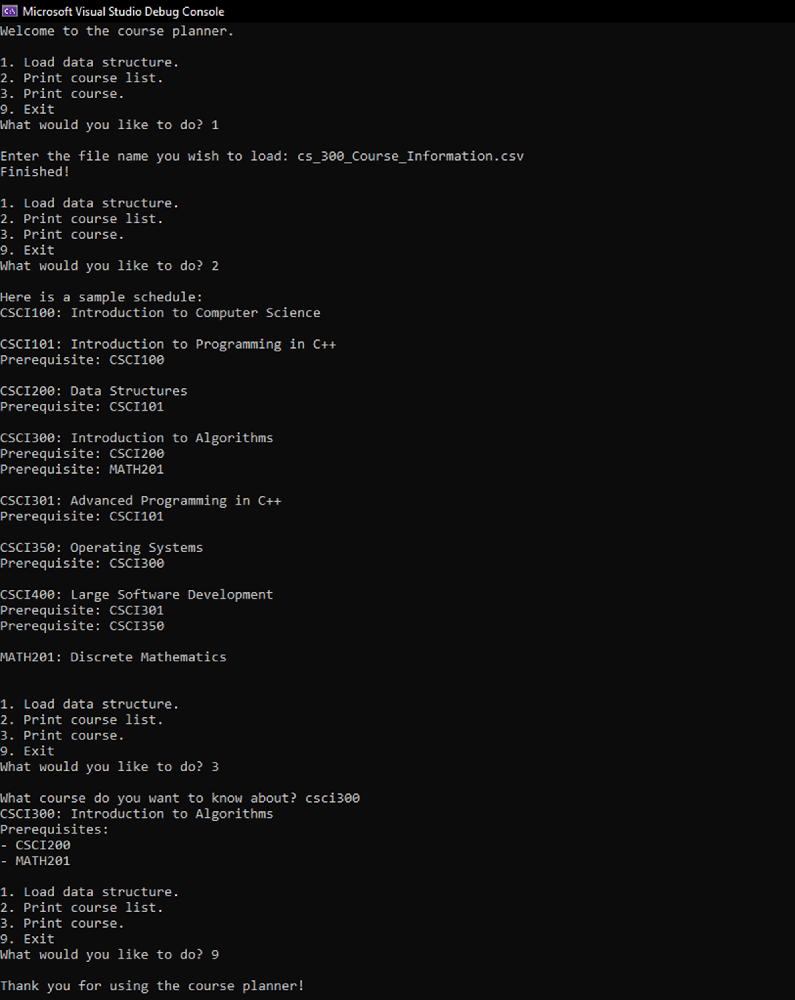

## Treasure Maze Q-Learning Agent
**Course:** CS-370 — Current & Emerging Trends in Computer Science  
**Tech:** Python, Q-learning, epsilon-greedy   
**Code:** 
<a href="projects/cs370-dqn/Murray_Orion_ProjectTwo.html" target="_blank" rel="noopener">
  Treasure Hunt Game Notebook
</a>

**What I built**
- Implemented the **Q-training algorithm** that learns from agent–environment interactions
- Added **epsilon-greedy** to balance exploration vs. exploitation
- Integrated with provided environment classes (**TreasureMaze**, **GameExperience**) that handled maze mechanics and experience storage

**Why it matters**
- Demonstrates practical **reinforcement learning**: algorithm design, policy control, and integrating with an existing environment

**Reflection**

- **What code were you given? What code did you create yourself?** 
  In this project I was provided with foundational code that included the environment setup being the maze structure for the TreasureMaze and GameExperience classes. These classes handled the basic mechanics of the game environment such as how the agent interacts with the maze and how experiences are stored for later use. I provided the code responsible for the Q-training algorithm that defined how the agent learned from its interactions with the environment and updating it's memory. I also integrated the epsilon-greedy strategy to balance exploration and exploitation so the agent could learn how to navigate the maze to find the treasure. 

- **What do computer scientists do and why does it matter?** 
  Computer scientists are problem solvers who use computational methods to find efficient solutions to complex problems. This involves not just coding but also understanding the underlying principles of computation, data management, and software design. It matters because they drive innovation by developing new algorithms, software, and technologies that push the boundaries of what is possible in fields like in this case artificial intelligence.

- **How do I approach a problem as a computer scientist?** 
  When approaching a problem as a computer scientist I try to follow a systematic process to ensure that the solution is both effective and efficient. This consists of understaning the clients requirements, planning out the design of the project, and then implementing a iterative product that has been throughly tested. If any feedback is given i try to go back and incorporate those changes.

- **What are my ethical responsibilities to the end user and the organization?** 
  My ethical responsibilties to end users and the orginization would be to use secure and transparent methods for processing data. If data isn’t handled responsibly, either the company itself could exploit its customers, or a bad actor could cause a breach. To address this, I would advocate for complete transparency with users about their data, provide an easy and effective way for them to opt out of data usage, and employ robust security measures to store and encrypt user information.

---

## Choosing the Right Data Structure - Course Catalog 
**Course:** CS-300 — Data Structures & Algorithms  
**Tech:** C++, CSV parsing, Binary Search Tree, Hash Table, Vector  
**Code:**  <a href="{{ '/assets/downloads/cs300-bst.zip' | relative_url }}" download
   style="display:inline-block;padding:10px 14px;border:1px solid #ccc;border-radius:8px;text-decoration:none;">
 Download ZIP
</a>

**Problem**  
Build a program that loads a CSV of Computer Science courses, prints an alphabetized course list, and shows details + prerequisites for a selected course.

**Approach**  
- Compared **Vector**, **Hash Table**, and **Binary Search Tree (BST)** against the requirements.  
- Chose **BST keyed by course ID** to get sorted output via in-order traversal and **O(log n)** lookups.  
- Noted trade-offs: Hash Table’s average **O(1)** lookup but **no inherent ordering**; Vector is simple but requires **O(n log n)** sort for ordered output and **O(n)** search.  
- Implemented `loadCSV()`, `insertCourse()`, `findCourse()`, `printAll()`, and `printCourse()` with clear separation of parsing, storage, and presentation.

**Why it matters**  
Shows how selecting the right structure impacts performance, scalability, and maintainability for everyday data tasks.

**Output**
Screenshot of the program running:

**Reflection**

- **What was the problem you were solving in the projects for this course?** 
The problem being solved in this project was determining the best data structure for a program to load a csv file, print a full list of courses for a Computer Science program, and to display course information and prerequisites for each selected course.

- **How did you approach the problem? Consider why data structures are important to understand.** 
I approached this problem by researching the different data structures being Vectors(Linked Lists), Hash Tables, and Binary Search Trees. When considering the BST and the requirements I felt that this would be the best type of data structures for this project. Binary search trees inherently sorted and should help decrease search times as they are pulled at O(log n). I also consider this in sake of future scalability for search. A Hash Table will also not retain order so every time the data is loaded it will have to be sorted afterwards at O(n log n). While a Hash Table is a good frequent single search, it’s not ideal for situations where you wanted sorted data. When considering the Vector, I believe this would be the easiest data structure to initially implement, but not the best-case long term. The time complexity needed to load the data is o(1) but sorting the list alphanumerically will be longer if the data needs to be sorted.

- **How did you overcome any roadblocks you encountered while going through the activities or project?** 
Lot of studying and reading. I've been a bit frustrated in the past when i ran into issues such as IDE errors on setup or compiling in addition to unfamiliarity with C++ at the beginning, but I just stayed the course, took breaks when needed, and spent a lot of spare time practicing coding and understanding the concepts of data structures.

- **How has your work on this project expanded your approach to designing software and developing programs?** 
I believe my approach has expanded. I feel more confident to tackle problems and I’m getting to a point where I'm liking the challenges and results once a problem has been resolved. It's also helped me try to seek out new projects to continue to sharpen my skills.

- **How has your work on this project evolved the way you write programs that are maintainable, readable, and adaptable?** 
I think this project has completely evolved the way I will write programs moving forward. While I was aware these of these concepts and how to implement them it felt as though I was doing so more from memory than understanding. I was able to maintain clean enough code throughout the course to use on the final project which help tremendously.

---

